# Audio Summarizer

一个用于自动处理音视频文件并生成文字总结的Python工具。

版本：1.1

## 功能特点

- 🔍 **自动查找音视频文件**：递归扫描目录，支持多种音视频格式
- 🎵 **音频提取**：从视频文件中提取音频（多进程并行）
- ☁️ **OSS上传**：将音频文件上传到阿里云OSS（多进程并行）
- 📝 **语音转文字**：使用阿里云Fun-ASR API将音频转换为文字（多进程并行）
- 📊 **文字总结**：使用DeepSeek API生成文字总结（多进程并行）
- ⚡ **高性能**：支持多进程并行处理，提高处理速度
- 📋 **完整日志**：详细的处理日志和进度显示

## 安装

### 1. 克隆项目

```bash
git clone https://github.com/UniBinary/audio_summarizer.git
cd audio_summarizer
```

### 2. 安装依赖

```bash
pip install -e .
```

或者手动安装依赖：

```bash
pip install oss2>=2.19.1 dashscope>=1.25.12 openai
```

### 3. 准备资源文件

将 `ffmpeg.exe` 和 `ffprobe.exe` 放在 `audiosummarizer/assets/` 目录下。

## 配置

### 1. 获取API密钥和OSS配置

使用本项目需要：

1. **阿里云OSS**：
   - AccessKey ID 和 AccessKey Secret
   - OSS存储桶名称和Endpoint

2. **阿里云百炼（Fun-ASR）**：
   - API Key

3. **DeepSeek**：
   - API Key

### 2. 创建配置文件

创建 `config.json` 文件：

```json
{
  "bucket-name": "your-bucket-name",
  "bucket-endpoint": "https://oss-cn-beijing.aliyuncs.com",
  "bucket-access-key-id": "your-access-key-id",
  "bucket-access-key-secret": "your-access-key-secret",
  "model-api-key": "your-funasr-api-key",
  "deepseek-api-key": "your-deepseek-api-key"
}
```

## 使用方法

### 命令行方式

```bash
# 基本用法（使用配置文件）
python -m audiosummarizer --input-dir /path/to/videos --output-dir /path/to/output --config-file config.json

# 指定进程数
python -m audiosummarizer --input-dir /path/to/videos --output-dir /path/to/output --processes 4 --config-file config.json

# 仅音频模式（输入目录只有音频文件）
python -m audiosummarizer --input-dir /path/to/audios --output-dir /path/to/output --audio-only --config-file config.json

# 直接指定所有参数
python -m audiosummarizer --input-dir /path/to/videos --output-dir /path/to/output \
  --bucket-name your-bucket --bucket-endpoint https://oss-cn-beijing.aliyuncs.com \
  --access-key-id your-key-id --access-key-secret your-key-secret \
  --funasr-api-key your-funasr-key --deepseek-api-key your-deepseek-key
```

### Python API方式

```python
from audiosummarizer import summarize

# 使用配置文件
summarize(
    input_dir="/path/to/videos",
    output_dir="/path/to/output",
    processes=4,
    audio_only=False,
    config_file="config.json"
)

# 直接指定参数
summarize(
    input_dir="/path/to/videos",
    output_dir="/path/to/output",
    processes=4,
    audio_only=False,
    bucket_name="your-bucket",
    bucket_endpoint="https://oss-cn-beijing.aliyuncs.com",
    access_key_id="your-key-id",
    access_key_secret="your-key-secret",
    funasr_api_key="your-funasr-key",
    deepseek_api_key="your-deepseek-key"
)
```

## 处理流程

项目按照以下步骤处理音视频文件：

```mermaid
graph LR
    A[寻找音视频文件] --> B[提取音频]
    B --> C[上传音频到OSS]
    C --> D[音频转文字]
    D --> E[总结文字]
```



### 步骤详解

1. **寻找音视频文件** (`AVFinder`)
   - 递归扫描输入目录
   - 支持的文件格式：`.mp3`, `.wav`, `.flac`, `.aac`, `.ogg`, `.m4a`, `.wma`, `.opus`, `.mp4`, `.avi`, `.mkv`, `.mov`, `.wmv`, `.flv`, `.webm`, `.m4v`, `.mpg`, `.mpeg`
   - 生成文件列表JSON

2. **提取音频** (`AudioExtractor`)
   - 从视频文件中提取音频轨道
   - 音频文件命名为 `001.mp3`, `002.mp3` 等（保持原顺序）
   - 多进程并行处理

3. **上传音频到OSS** (`OSSUploader`)
   - 将音频文件上传到阿里云OSS
   - 文件存储在 `oss://audios/` 目录下
   - 生成可访问的URL列表
   - 多进程并行上传

4. **音频转文字** (`AudioTranscriber`)
   - 使用阿里云Fun-ASR API进行语音识别
   - 支持说话人分离（声纹识别）
   - 输出格式：`<说话人ID>: <文本>`
   - 多进程并行处理

5. **总结文字** (`TextSummarizer`)
   - 使用DeepSeek API生成文字总结
   - 输出Markdown格式
   - 在总结开头添加原视频链接（如果提供）
   - 多进程并行处理

## 输出文件结构

```
output_dir/
├── audio_summarizer.log          # 日志文件
├── intermediates/
│   └── YYYYMMDD_HHMMSS/          # 中间文件（时间戳目录）
│       ├── inputs.json           # 输入文件列表
│       ├── audios.json           # 音频文件列表
│       ├── oss_urls.json         # OSS URL列表
│       ├── texts.json            # 文本文件路径列表
│       ├── summaries.json        # 总结文件路径列表
│       ├── audios/               # 提取的音频文件
│       ├── texts/                # 转录的文本文件
│       └── summaries/            # 生成的总结文件
└── summaries/                    # 最终总结文件（符号链接）
    ├── 001.md
    ├── 002.md
    └── ...
```

## 费用估算

截止2026年2月，处理一小时音视频的估算费用：

| 服务 | 费用 | 说明 |
|------|------|------|
| 阿里云OSS | 0.014元 | 上传+读取，约100MB流量 |
| 阿里云Fun-ASR | 0.76元 | 语音识别，使用节省计划 |
| DeepSeek | 0.028元 | 文字总结 |
| **总计** | **约0.8元/小时** | |

## 类说明

### AVFinder
- **功能**：查找音视频文件
- **参数**：`input_dir`, `output_json`, `logger`
- **方法**：`find_and_save()`

### AudioExtractor
- **功能**：从视频中提取音频
- **参数**：`input_json`, `output_json`, `audio_dir`, `ffmpeg_path`, `ffprobe_path`, `num_processes`, `logger`
- **方法**：`process_videos()`

### OSSUploader
- **功能**：上传文件到阿里云OSS
- **参数**：`input_json`, `output_json`, `bucket_name`, `bucket_endpoint`, `access_key_id`, `access_key_secret`, `num_processes`, `logger`
- **方法**：`upload_files()`

### AudioTranscriber
- **功能**：音频转文字
- **参数**：`input_json`, `output_json`, `text_dir`, `model_api_key`, `num_processes`, `logger`
- **方法**：`transcribe_audio()`

### TextSummarizer
- **功能**：总结文字
- **参数**：`input_json`, `output_json`, `summary_dir`, `model_api_key`, `num_processes`, `origin_json`, `logger`
- **方法**：`summarize_texts()`

## 注意事项

1. **费用控制**：处理大量文件前，建议先测试小批量文件
2. **网络要求**：需要稳定的网络连接访问OSS和API
3. **文件大小**：单个音频文件不宜过大，建议分割长音频
4. **API限制**：注意各API的调用频率和并发限制
5. **隐私保护**：音频内容可能包含敏感信息，请妥善处理

## 故障排除

### 常见问题

1. **导入错误**：确保已安装所有依赖 `pip install oss2 dashscope openai`
2. **OSS连接失败**：检查AccessKey和Endpoint配置
3. **API调用失败**：检查API密钥和网络连接
4. **ffmpeg错误**：确保 `ffmpeg.exe` 和 `ffprobe.exe` 在正确位置

### 日志查看

查看 `output_dir/audio_summarizer.log` 获取详细错误信息。

## 许可证

MIT License

## 作者

UniBinary - tp114514251@outlook.com

## 项目地址

GitHub: https://github.com/UniBinary/audio_summarizer